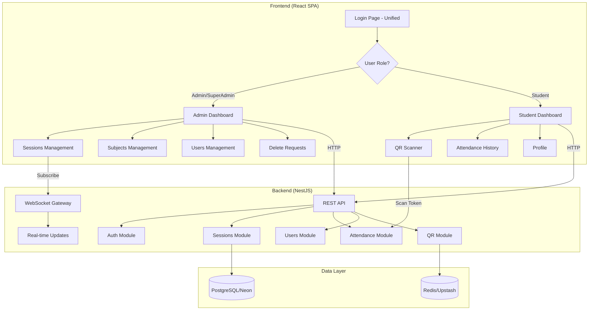
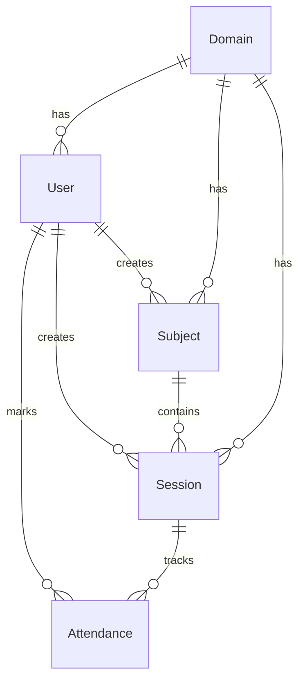
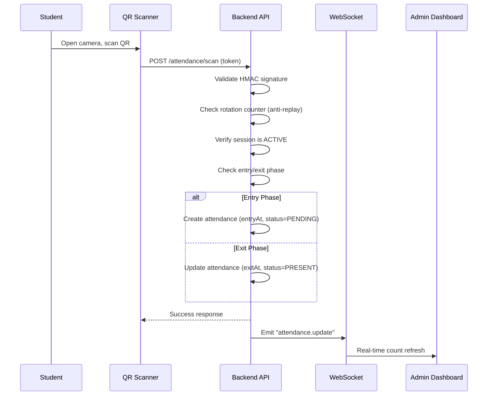
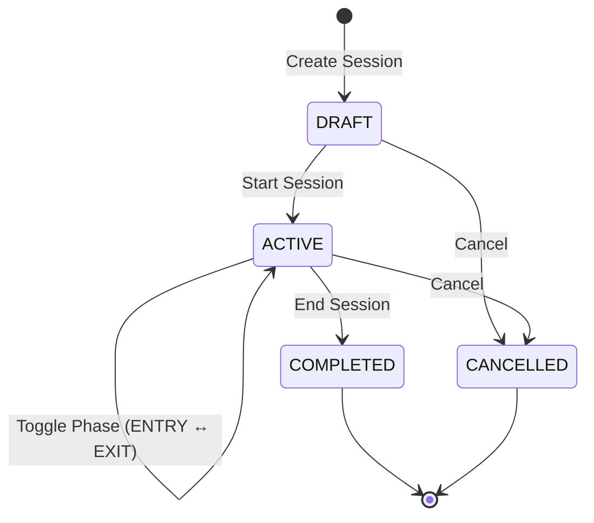
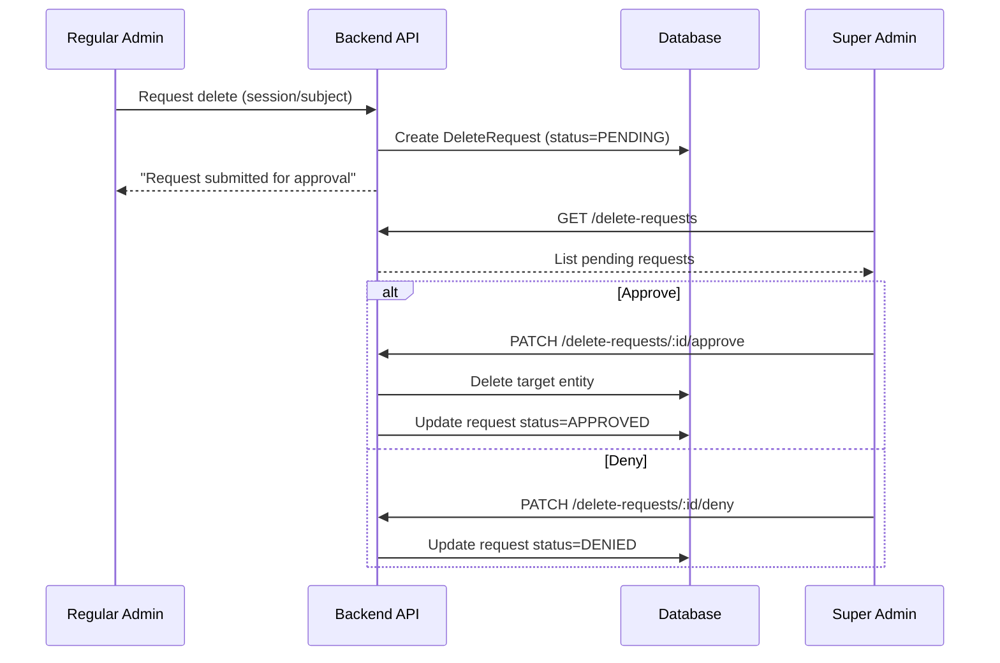

# SmartQR Attendance System - Implementation Plan & Flow

## Overview

SmartQR is a secure, real-time attendance management system designed for educational institutions. It uses dynamic QR codes with fraud-prevention mechanisms (token rotation, device fingerprinting, geo-fencing) to track student attendance while supporting role-based access control.

---

## Architecture Flow



---

## Phase 1: Foundation & Core Backend

### 1.1 Project Setup
- **Backend**: NestJS 10 with TypeScript
- **Frontend**: React 18 (Vite 5) with TypeScript
- **Database**: PostgreSQL via Prisma ORM
- **Real-time**: Socket.io for WebSocket communication

### 1.2 Database Schema Design

The data model consists of 6 core entities:

| Model | Purpose |
|-------|---------|
| **Domain** | Multi-tenant organization/institution |
| **User** | All users (Super Admin, Admin, Student) |
| **Subject** | Academic subjects/courses |
| **Session** | Attendance sessions for each subject |
| **Attendance** | Individual attendance records |
| **DeleteRequest** | Approval workflow for destructive actions |



### 1.3 Backend Modules Implemented

| Module | Location | Purpose |
|--------|----------|---------|
| `auth/` | [backend/src/auth/](file:///c:/Projects/smartqr-attendance/backend/src/auth) | JWT authentication, login, refresh tokens |
| `users/` | [backend/src/users/](file:///c:/Projects/smartqr-attendance/backend/src/users) | User CRUD, PRN assignment, role management |
| `domains/` | [backend/src/domains/](file:///c:/Projects/smartqr-attendance/backend/src/domains) | Multi-tenant domain management |
| `subjects/` | [backend/src/subjects/](file:///c:/Projects/smartqr-attendance/backend/src/subjects) | Subject CRUD with creator filtering |
| `sessions/` | [backend/src/sessions/](file:///c:/Projects/smartqr-attendance/backend/src/sessions) | Session lifecycle (DRAFT → ACTIVE → COMPLETED) |
| `qr/` | [backend/src/qr/](file:///c:/Projects/smartqr-attendance/backend/src/qr) | HMAC-SHA256 token generation & rotation |
| `attendance/` | [backend/src/attendance/](file:///c:/Projects/smartqr-attendance/backend/src/attendance) | Scan validation, entry/exit tracking |
| `anomaly/` | [backend/src/anomaly/](file:///c:/Projects/smartqr-attendance/backend/src/anomaly) | Fraud detection (geo-dispersion) |
| `ws/` | [backend/src/ws/](file:///c:/Projects/smartqr-attendance/backend/src/ws) | WebSocket gateway for real-time updates |
| `delete-requests/` | [backend/src/delete-requests/](file:///c:/Projects/smartqr-attendance/backend/src/delete-requests) | Approval workflow for deletions |
| `profile/` | [backend/src/profile/](file:///c:/Projects/smartqr-attendance/backend/src/profile) | Student profile management |
| `health/` | [backend/src/health/](file:///c:/Projects/smartqr-attendance/backend/src/health) | Health check endpoint |

---

## Phase 2: Authentication & Role-Based Access

### 2.1 Unified Login System
- Single login page at `/login` for all user types
- Backend detects role and returns appropriate JWT
- Frontend redirects based on role:
  - **Super Admin/Admin** → `/admin/sessions`
  - **Student** → `/student/dashboard`

### 2.2 Role Permissions Matrix

| Feature | Super Admin | Admin | Student |
|---------|:-----------:|:-----:|:-------:|
| Create Domain | ✅ | ❌ | ❌ |
| Create Admin Users | ✅ | ❌ | ❌ |
| Create Student Users | ✅ | ✅ | ❌ |
| View All Subjects | ✅ | Own Only | ❌ |
| Create/Manage Sessions | ✅ | ✅ | ❌ |
| Delete Sessions/Subjects | ✅ | Request Required | ❌ |
| Approve Delete Requests | ✅ | ❌ | ❌ |
| Scan QR for Attendance | ❌ | ❌ | ✅ |
| Edit Own Profile | ✅ | ✅ | ✅ |

### 2.3 Multi-Admin Data Isolation
- Regular admins only see subjects/sessions they created
- Super Admins have access to all data
- Students can view all active sessions in their domain

---

## Phase 3: QR Code & Attendance Flow

### 3.1 QR Token Format

```
<base64url_payload>.<hex_signature>
```

**Payload Structure:**
```json
{
  "sid": "session-uuid",
  "did": "domain-1",
  "iat": 1704067200,
  "exp": 1704067230,
  "rot": 5
}
```

### 3.2 Token Rotation
- Tokens rotate every 30 seconds (configurable via `QR_TTL_SECONDS`)
- Each rotation increments `rotationCounter` to prevent replay attacks
- HMAC-SHA256 signature prevents tampering

### 3.3 Attendance Marking Flow



### 3.4 Session Lifecycle



---

## Phase 4: Frontend Implementation

### 4.1 Admin Pages

| File | Route | Purpose |
|------|-------|---------|
| [Login.tsx](file:///c:/Projects/smartqr-attendance/frontend/src/pages/admin/Login.tsx) | `/login` | Unified login for all users |
| [Sessions.tsx](file:///c:/Projects/smartqr-attendance/frontend/src/pages/admin/Sessions.tsx) | `/admin/sessions` | List/manage sessions |
| [CreateSession.tsx](file:///c:/Projects/smartqr-attendance/frontend/src/pages/admin/CreateSession.tsx) | `/admin/sessions/new` | Create new session |
| [SessionDetail.tsx](file:///c:/Projects/smartqr-attendance/frontend/src/pages/admin/SessionDetail.tsx) | `/admin/sessions/:id` | Session detail + QR display |
| [Subjects.tsx](file:///c:/Projects/smartqr-attendance/frontend/src/pages/admin/Subjects.tsx) | `/admin/subjects` | List/manage subjects |
| [SubjectDetail.tsx](file:///c:/Projects/smartqr-attendance/frontend/src/pages/admin/SubjectDetail.tsx) | `/admin/subjects/:id` | Subject detail with sessions |
| [Users.tsx](file:///c:/Projects/smartqr-attendance/frontend/src/pages/admin/Users.tsx) | `/admin/users` | User management |
| [DeleteRequests.tsx](file:///c:/Projects/smartqr-attendance/frontend/src/pages/admin/DeleteRequests.tsx) | `/admin/delete-requests` | Approval queue (Super Admin) |
| [Profile.tsx](file:///c:/Projects/smartqr-attendance/frontend/src/pages/admin/Profile.tsx) | `/admin/profile` | View/edit profile |

### 4.2 Student Pages

| File | Route | Purpose |
|------|-------|---------|
| [CurrentSession.tsx](file:///c:/Projects/smartqr-attendance/frontend/src/pages/student/CurrentSession.tsx) | `/student/dashboard` | View active sessions |
| [Scanner.tsx](file:///c:/Projects/smartqr-attendance/frontend/src/pages/student/Scanner.tsx) | `/student/scan` | QR scanner for attendance |
| [SessionScanner.tsx](file:///c:/Projects/smartqr-attendance/frontend/src/pages/student/SessionScanner.tsx) | `/student/sessions/:id/scan` | Session-specific scanner |
| [MyAttendance.tsx](file:///c:/Projects/smartqr-attendance/frontend/src/pages/student/MyAttendance.tsx) | `/student/attendance` | Attendance history |
| [Profile.tsx](file:///c:/Projects/smartqr-attendance/frontend/src/pages/student/Profile.tsx) | `/student/profile` | Edit personal details |
| [Confirmation.tsx](file:///c:/Projects/smartqr-attendance/frontend/src/pages/student/Confirmation.tsx) | `/student/confirmation` | Scan success confirmation |

---

## Phase 5: UI/UX Design

### 5.1 Liquid Glass Design System
- **Design Philosophy**: Glassmorphism inspired by iOS/macOS
- **Dark Mode**: "Tokyo Cyberpunk Night" - Electric cyan (#00D4FF), soft purple accents
- **Light Mode**: "Clean Modern" - Navy blue (#1E40AF) on soft white/gray backgrounds

### 5.2 Key Features
- CSS custom properties for theming
- Backdrop blur effects on modals and overlays
- Smooth page transitions (sliding curtain effect)
- Scanline animation overlay (dark mode)
- Responsive grid layouts

---

## Phase 6: Delete Request Approval Workflow

### 6.1 Flow



---

## Phase 7: Deployment

### 7.1 Docker Multi-Stage Build
- Build stage: Node 20 Alpine, install deps, generate Prisma, compile TypeScript
- Production stage: Minimal image, production deps only
- Startup: Run migrations → seed → start server

### 7.2 Render.com Configuration
- **Backend**: Web service with Node runtime
- **Frontend**: Static site
- **Database**: Neon PostgreSQL
- **Cache**: Upstash Redis

### 7.3 Environment Variables

| Variable | Purpose |
|----------|---------|
| `DATABASE_URL` | PostgreSQL connection (Neon) |
| `REDIS_URL` | Redis connection (Upstash) |
| `JWT_SECRET` | Access token signing key |
| `REFRESH_TOKEN_SECRET` | Refresh token signing key |
| `HMAC_SECRET` | QR token HMAC key |
| `CORS_ORIGINS` | Allowed frontend origins |
| `VITE_API_URL` | Backend API URL (frontend) |
| `VITE_WS_URL` | WebSocket URL (frontend) |

---

## Security Features Implemented

| Feature | Implementation |
|---------|----------------|
| Password Hashing | bcrypt with salt rounds |
| JWT Authentication | Short-lived access (15m), long-lived refresh (7d) |
| Token Rotation | QR tokens rotate every 30 seconds with counter validation |
| Rate Limiting | Global (100/min), scan-specific (10/min) |
| CORS | Strict origin whitelist |
| Helmet | Security headers (XSS, clickjacking protection) |
| Input Validation | class-validator DTOs on all endpoints |
| Device Fingerprinting | IP + User-Agent logging, optional device FP |
| Role Guards | Decorator-based access control per endpoint |

---

## Key Files Reference

### Backend
- [schema.prisma](file:///c:/Projects/smartqr-attendance/backend/prisma/schema.prisma) - Database schema
- [app.module.ts](file:///c:/Projects/smartqr-attendance/backend/src/app.module.ts) - Main module
- [sessions.controller.ts](file:///c:/Projects/smartqr-attendance/backend/src/sessions/sessions.controller.ts) - Session API
- [users.controller.ts](file:///c:/Projects/smartqr-attendance/backend/src/users/users.controller.ts) - User API
- [Dockerfile](file:///c:/Projects/smartqr-attendance/backend/Dockerfile) - Container configuration

### Frontend
- [index.css](file:///c:/Projects/smartqr-attendance/frontend/src/styles/index.css) - Global styles

### Documentation
- [PROJECT_DOCUMENTATION.md](file:///c:/Projects/smartqr-attendance/PROJECT_DOCUMENTATION.md) - Full SRS
- [README.md](file:///c:/Projects/smartqr-attendance/README.md) - Quick start guide
- [render.yaml](file:///c:/Projects/smartqr-attendance/render.yaml) - Deployment blueprint

---

## Future Enhancements (Planned)

- [ ] Push notifications for session start
- [ ] Bulk student import via CSV
- [ ] Attendance analytics dashboard with charts
- [ ] Export attendance reports (PDF, Excel)
- [ ] Multi-factor authentication
- [ ] Geo-fencing enforcement
- [ ] Facial recognition as secondary verification
- [ ] Mobile app (React Native)

---

*Document generated on 2025-12-12*
