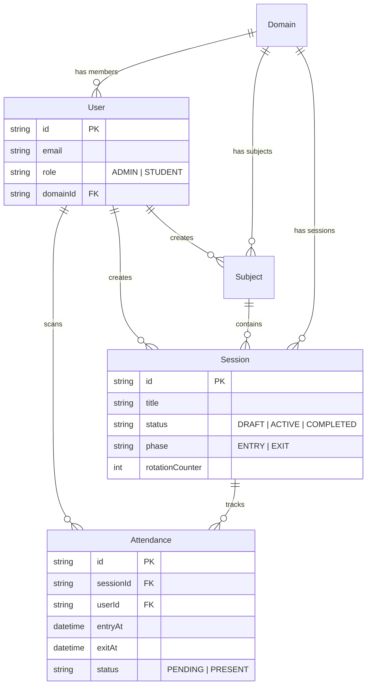
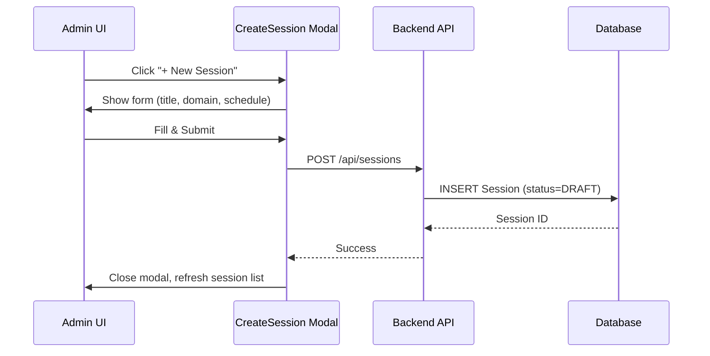
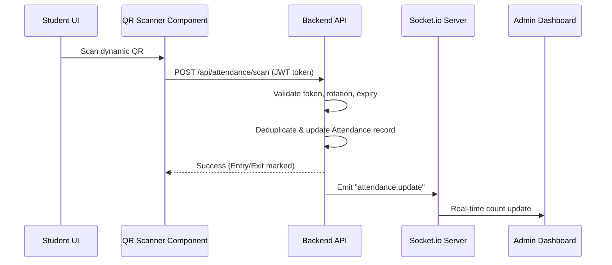

# SmartQR Attendance System - Project Documentation (SRS)

## 1. Introduction
SmartQR is a secure, real-time attendance management system designed for educational domains. It uses dynamic QR codes to track student attendance with fraud‑prevention mechanisms (token rotation, device fingerprinting, geo‑fencing). The system supports role‑based access (Super Admin, Admin, Student) and provides live dashboards for administrators.

## 2. Technology Stack
### 2.1 Frontend
- **Framework:** React 18 (Vite)
- **Language:** TypeScript
- **Styling:** Custom "Vintage Neon" design system (raw CSS variables)
  - Dark Mode: "Tokyo Cyberpunk Night" (blue neon, reduced glow)
  - Light Mode: "Clean Modern" (navy blue text on soft white/gray)
- **State Management:** React Context API (Auth, Theme)
- **HTTP Client:** Axios
- **QR Scanning:** @zxing/library
- **Animations:** CSS transitions, page‑slide curtain effect
- **Modal System:** Floating modal component with backdrop blur

### 2.2 Backend
- **Framework:** NestJS (v10)
- **Language:** TypeScript
- **Database ORM:** Prisma
- **Database:** SQLite (dev) / PostgreSQL (prod)
- **Real‑time:** Socket.io (WebSockets)
- **Queue System:** BullMQ (Redis)
- **Authentication:** Passport, JWT (access & refresh tokens)
- **Security:** Helmet, Throttler, rate limiting
- **Testing:** Jest, Supertest

## 3. System Architecture
```mermaid
graph TD
    subgraph Frontend
        Client[React SPA]
        QRScanner[QR Scanner Component]
        Modal[Floating Modal]
        ThemeToggle[Theme Toggle]
    end
    subgraph Backend
        API[NestJS API]
        WS[Socket.io Server]
        Queue[BullMQ (Redis)]
        DB[(Prisma → SQLite/Postgres)]
    end
    Client -->|HTTP/REST| API
    Client -->|WebSocket| WS
    API -->|Prisma ORM| DB
    API -->|BullMQ| Queue
    QRScanner -->|POST /attendance/scan| API
    Modal -->|POST /sessions| API
    ThemeToggle -->|localStorage| Client
    WS -->|emit attendance.update| Client
```

## 4. Database Schema (ERD)


## 5. Detailed User Flows
### 5.1 Session Creation (Admin) – Floating Modal

### 5.2 Theme Toggle (User)
```mermaid
flowchart LR
    A[User clicks Theme Toggle] --> B{Current Theme?}
    B -->|Light| C[Set data-theme="dark"]
    B -->|Dark| D[Set data-theme="light"]
    C & D --> E[Persist choice in localStorage]
    E --> F[UI updates via CSS variables]
```
### 5.3 Attendance Marking (Student)

### 5.4 Page Transition – Sliding Curtain
```mermaid
stateDiagram-v2
    [*] --> HomePage
    HomePage -->|Navigate| SessionList : click "Sessions"
    SessionList -->|Navigate| SessionDetail : click a session
    SessionDetail -->|Back| SessionList : click back
    note right of SessionList
        CSS classes .page-enter / .page-exit
        animate translateX & opacity
    end
```

## 6. Key Features Implementation
### 6.1 Dynamic QR Codes
- Backend rotates a JWT token every **X** seconds (configurable).
- `Session.rotationCounter` increments on each rotation.
- Token payload: `{ sessionId, iat, exp, rotationCounter }`.
- Frontend scans QR, sends token to `/attendance/scan`.
- Server validates rotation counter to prevent replay attacks.

### 6.2 Fraud Prevention
- **Device Fingerprinting:** Captures User‑Agent, IP, optional device fingerprint.
- **Geo‑fencing:** (optional) Validates scan location against session venue coordinates.
- **Entry/Exit Pairing:** Requires both scans to mark full attendance; status transitions from `PENDING` → `PRESENT`.

### 6.3 Real‑time Dashboard
- Socket.io broadcasts `attendance.update` events.
- Admin UI subscribes and updates live counters without page reload.
- Modal system enables quick CRUD actions without full navigation.

## 7. API Overview
| Method | Endpoint | Description |
| :--- | :--- | :--- |
| **POST** | `/api/auth/login` | User login, returns access & refresh JWTs |
| **GET** | `/api/sessions` | List all sessions (role‑filtered) |
| **POST** | `/api/sessions` | Create a new session (admin) |
| **POST** | `/api/sessions/:id/start` | Activate session, start QR rotation |
| **POST** | `/api/attendance/scan` | Record attendance via scanned QR token |
| **GET** | `/api/attendance/:sessionId` | Retrieve attendance list for a session |

## 8. Non‑Functional Requirements
- **Performance:** Page load < 2 s, QR scan validation < 200 ms.
- **Scalability:** Stateless JWT auth; horizontal scaling via Redis session store.
- **Security:** HTTPS, Helmet headers, rate limiting, JWT expiration (15 min access, 7 days refresh).
- **Reliability:** Queue (BullMQ) ensures retry of attendance writes; DB migrations managed by Prisma.
- **Usability:** Responsive UI, high‑contrast mode, accessible modals (ARIA attributes).

## 9. Deployment & Operations
- **Frontend:** `npm run build` → static assets served via Nginx or Vercel.
- **Backend:** Dockerfile builds NestJS app; environment variables for DB URL, JWT secret, Redis URL.
- **CI/CD:** GitHub Actions lint, test, build, and push Docker images.
- **Monitoring:** Prometheus metrics exported by NestJS, Grafana dashboards for attendance rates.

---
*Document generated on 2025‑12‑06.*
